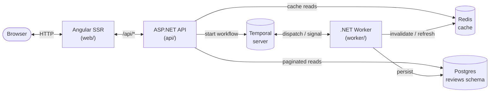
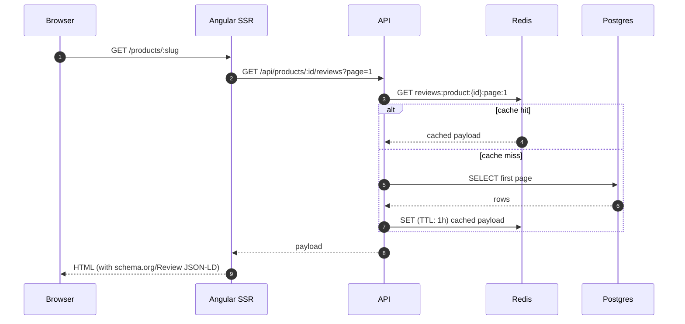
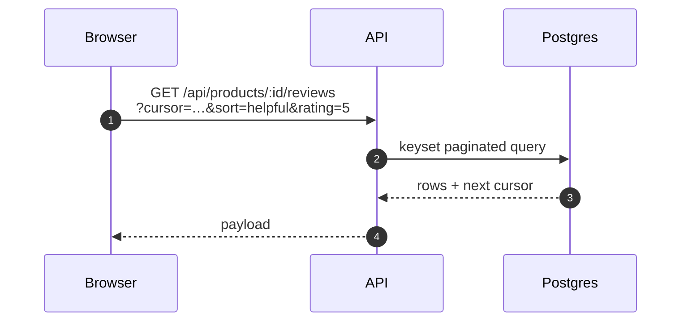
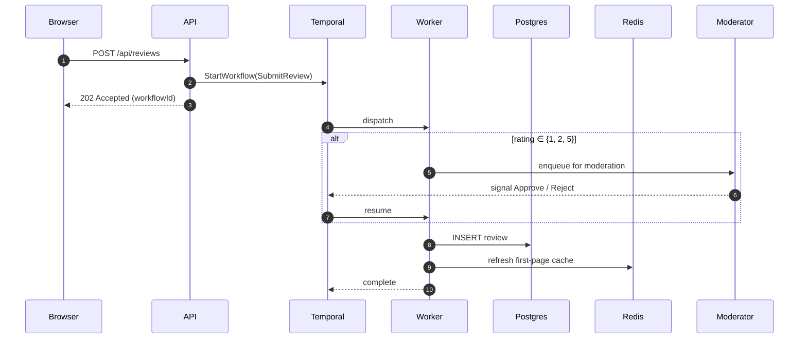
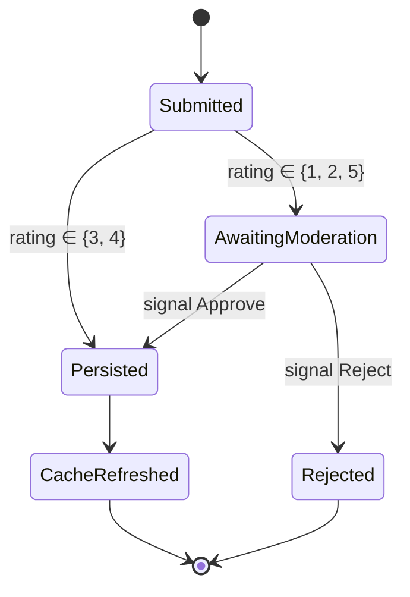
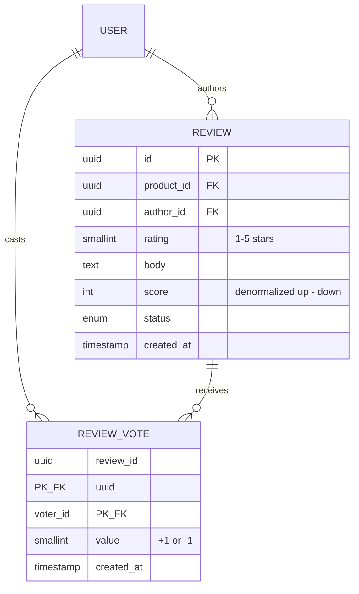
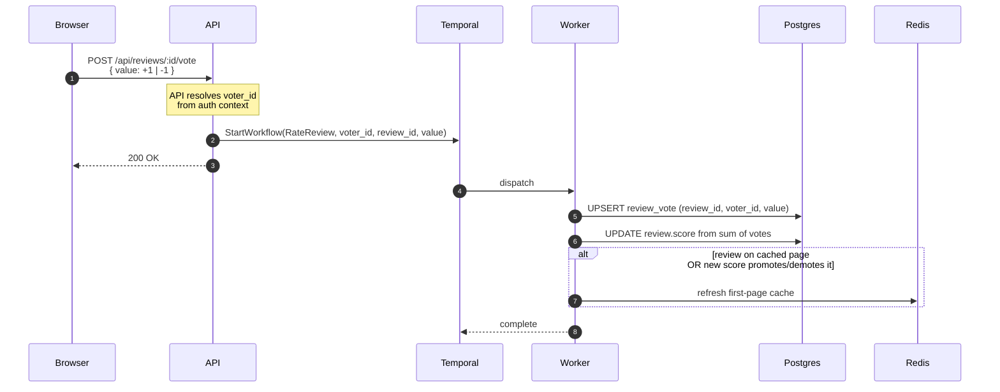

# Product flows

The four user-facing flows the platform is built around: viewing reviews, browsing more, submitting, and rating. Each section names the components involved, walks through the path with a sequence diagram, and lays out the rationale.

## Architecture at a glance

The API is the single boundary the frontend talks to. Reads that the user sees most often are served from Redis; reads that fan out by sort and filter go straight to postgres. Anything that mutates state goes through a Temporal workflow so the persist step and the cache-refresh step are durable together — a crash between them isn't possible.

---

## 1. Viewing reviews

The hot read path. When a user opens a product page, the SSR pass renders the first page of reviews into the HTML so crawlers and visitors both see content immediately.

- **Cache only this path.** The first page is what every visitor and crawler sees, so it's by far the hottest read. Subsequent pages and filtered views are long-tail and don't justify the cache cardinality.
- **Server-render it.** Review content needs to be in the HTML for SEO. The structured data (`schema.org/Review`) is computed from the same payload.
- **Cache the shaped payload.** Storing already-shaped UI payloads avoids re-shaping on every hit, at the cost of a re-cache when the schema changes — acceptable.

---

## 2. Browsing more reviews

A user clicks *More reviews* and lands on a paginated list. Sort (newest, most helpful, highest stars, lowest stars) and filters (rating, verified, with photos) are exposed; every variation hits postgres.

- **No cache.** Sort × filter × page would explode the keyspace, and the users who go past page one are a small fraction of total traffic — postgres handles the absolute load comfortably.
- **Keyset pagination, not OFFSET.** Stable under writes and avoids the deep-page penalty.
- **Indexes carry the sort orders.** `(product_id, created_at)`, `(product_id, score desc)`, etc. No application-level pagination tricks.

---

## 3. Submitting a review

The most non-trivial flow. Submission crosses an asynchronous boundary (manual moderation can take days) and has to update both the database and the cache atomically from the user's perspective.

The workflow itself, as a state machine:

- **Why the API stays in the path.** The frontend has exactly one server it talks to. Temporal's gRPC frontend isn't auth'd for end users, and exposing it would let any client start any workflow. The API validates input, attaches the authenticated user, picks the workflow, and starts it.
- **Why Temporal and not a plain job queue.** The moderation branch is an arbitrary-length wait. Temporal's signal-and-resume model and durable timers give us the right primitives without rebuilding them in app code. Crashes between persist and cache-refresh retry the *failed* activity, not the whole flow — the workflow is the source of truth for "where are we."
- **Why these rating buckets for moderation.** 1- and 2-star reviews are the most common targets of competitor abuse and venting; 5-star is where most fake or incentivised reviews land. 3 and 4 are the boring middle and rarely worth a moderator's time. The split is a starting point — heuristics (account age, IP, repeat-pattern detection) will replace or augment it later.
- **Why refresh the cache from inside the workflow.** The workflow already knows whether the review changed the first page. Doing it here keeps the cache invariant tied to the durable execution, not to the API layer where a crash mid-write would silently desync.

---

## 4. Rating a review

A user upvotes or downvotes a review. Every vote is its own row keyed on `(review_id, voter_id)`, so we always know who voted what. The score on the review is a denormalized sum maintained off the vote rows.

The composite primary key `(review_id, voter_id)` is what prevents double-voting and what makes flipping a vote a single UPSERT.

- **Why through Temporal too.** Same crash-safety argument as flow 3: the vote write, the score recompute, and the cache refresh need to land together or be retried. Open question whether click volume justifies a full workflow per vote vs. a lighter background task; we'll measure before deciding. For now, treating it the same as flow 3 keeps the moving parts uniform.
- **Why a single vote endpoint with `value: +1 | -1`.** One endpoint, one workflow, one idempotency key. Flipping from up to down is a single UPSERT, not a delete-then-insert.
- **Why store every vote, not just aggregate counters.** We need to know *who* voted to enforce one-vote-per-user, to let users see and change their own vote, to detect abuse patterns (sockpuppet rings, vote brigades), and to recompute the score deterministically if the denormalized field ever drifts.
- **The denormalized score is a cache, not a source of truth.** The vote rows are. A periodic reconcile job (and the workflow itself, on every vote) refreshes the score from the underlying votes — so a missed UPDATE doesn't leave the system permanently inconsistent.
- **Cache-touch heuristic.** Refresh the Redis page only if the review currently sits on the cached page or if its new score crosses the threshold of whatever's lowest on that page. Keeps unnecessary cache writes off the hot path.

---

## How this maps to the code today

The kickoff seed has the wiring proven end-to-end via the hello-world counter (`POST /api/hello` → `IncrementCounterWorkflow` → `CounterActivities` → Redis). None of the flows above are implemented yet — they're the next milestone. The skeleton each flow needs is already in place:

| Layer | Where it lands |
|---|---|
| API endpoints | `api/Program.cs` |
| Workflow types (referenced by both api + worker) | `shared/` |
| Activity implementations (postgres, Redis access) | `worker/` |
| Domain entities and migrations | `reviews` schema, provisioned by `infra/postgres-init.sh` |
| Cache keys | conventional: `reviews:product:{id}:page:1` |

Auth (ZITADEL via the BFF pattern), the moderation tooling, and the MCP server surface are all out of scope for the kickoff and tracked in the README's *Deferred for later milestones* section.
