# Product flows

How the platform behaves end-to-end, flow by flow. Each section names the components involved, walks the path with a sequence diagram, and lays out the rationale.

## Architecture at a glance

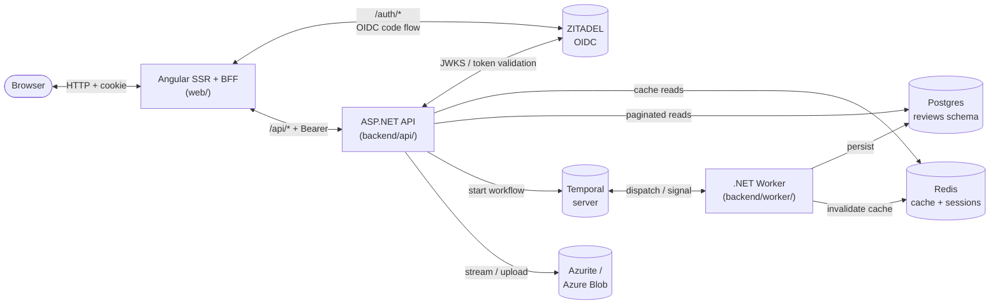

The browser never talks to ZITADEL or the API directly — the SSR/BFF process owns the session cookie and forwards `Authorization: Bearer <access_token>` on `/api/*` calls. Reads the user sees most often are served from Redis; reads that fan out by sort and filter go straight to Postgres. Anything that mutates state goes through a Temporal workflow so the persist step and the cache-invalidate step are durable together — a crash between them isn't possible.

---

## 1. Signing in

OIDC code flow with PKCE. Tokens stay server-side; the browser only ever holds an opaque session cookie.

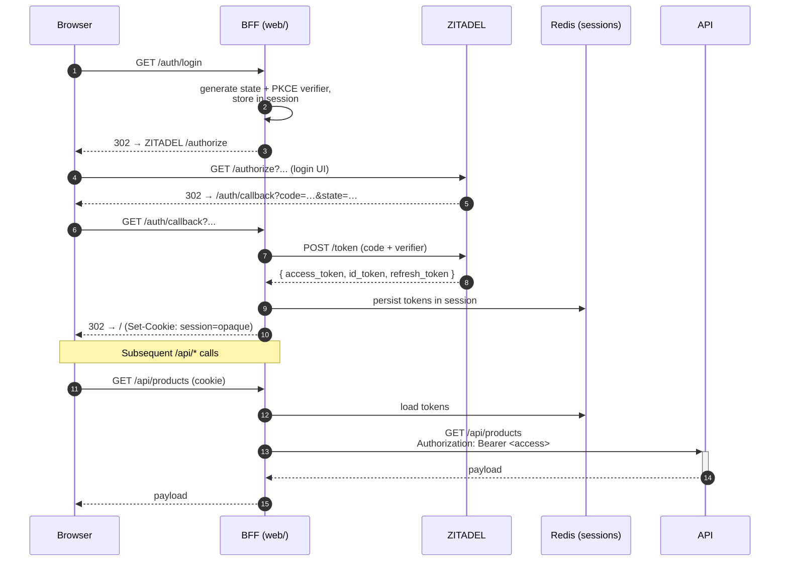

- **Why the BFF pattern.** Tokens never reach the browser. The session cookie is HTTP-only, SameSite=Lax, signed; XSS can't lift the access token. The OWASP-recommended SPA shape as of 2025.
- **Why Redis for sessions.** SSR runs as a horizontally-scalable Node process — sticky-session affinity in load balancers is a leaky abstraction. Externalising the store decouples request routing from session ownership.
- **Token refresh.** Handled server-side by the BFF on access-token expiry, transparent to the browser. The session cookie's lifetime is independent of token expiry.
- **`/auth/me`.** Lightweight identity endpoint the SPA polls on boot to know whether to render the signed-in chrome. Returns the id-token claims (`sub`, `name`, `email`) when authenticated, `{ authenticated: false }` otherwise.

---

## 2. Browsing the catalog

The site root: a list of products with images, names, average ratings, and review counts. Cached as a single payload; uncached path is a simple aggregate query.

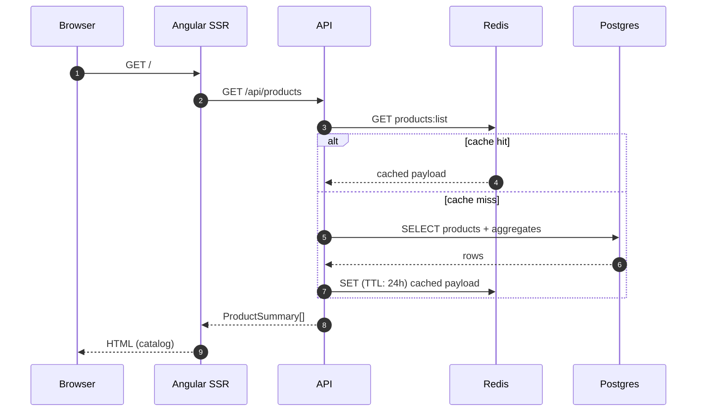

- **Cached at the shaped-payload level**, not at the row level — avoids re-shaping per request.
- **Average rating is computed on the fly** today (a `JOIN reviews GROUP BY product`); a denormalised column on `products` is on the roadmap so the cache miss path stays fast as the catalog grows.

---

## 3. Viewing a product page

The hot read path. SSR renders the first page of reviews into the HTML so crawlers and visitors both see content immediately. The product detail and the first page of reviews are two separate cache surfaces but the SSR pass fetches both.

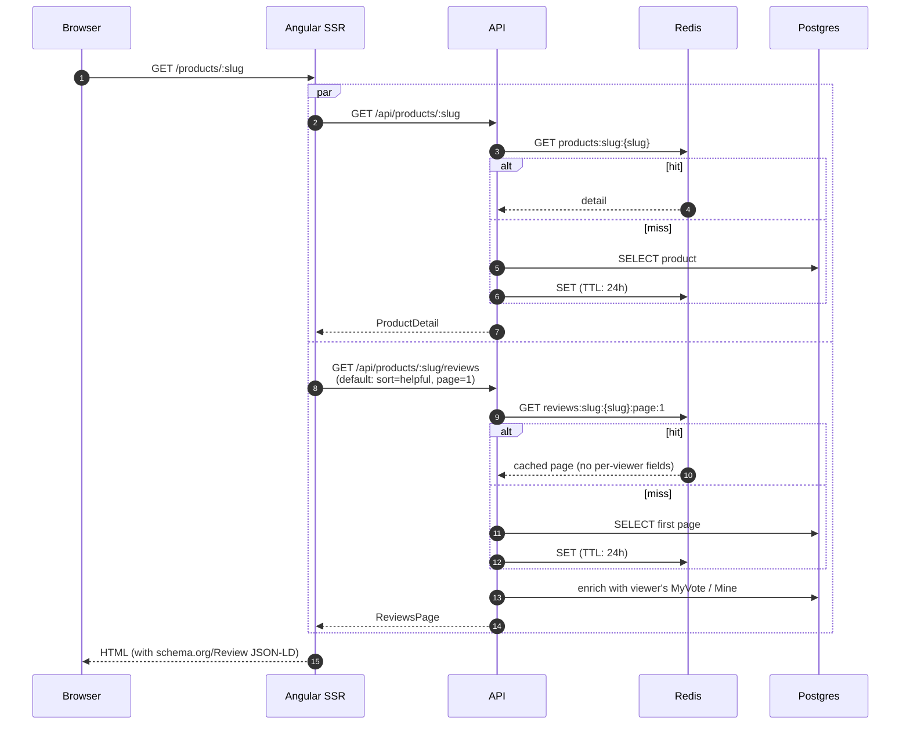

- **Cache only the first-page-default-sort path.** That's what every visitor and crawler sees; sorts/filters/deeper pages are long-tail and don't justify the cache cardinality.
- **Per-viewer fields are stripped before caching** (`MyVote`, `Mine`, `MyReviewId`) and re-merged on read with one PK lookup. Keeps the cached payload viewer-agnostic.
- **Server-render reviews into the HTML** for SEO. The structured data (`schema.org/Review`) is generated from the same payload so the markup and the JSON-LD can't drift.

---

## 4. Browsing reviews with sort / filter / pagination

A user clicks **More reviews** or changes the sort. Sort (newest, most helpful, highest stars, lowest stars), rating filter (multi-select 1–5), and a "with photos" toggle are exposed; every variation hits Postgres directly.

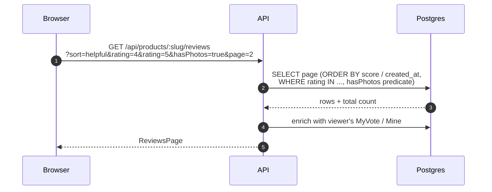

- **No cache.** `sort × ratings-subset × hasPhotos × page` would explode the keyspace, and the users who go past page one are a small fraction of total traffic — Postgres handles the absolute load comfortably.
- **Page-based, not keyset.** Simple page numbers play well with sortable column headers and rating filters; keyset pagination's stability advantage matters most for append-only timelines, which this isn't.
- **Indexes carry the sort orders.** `(product_id, score desc, id desc)` and `(product_id, rating, id desc)` etc. Review IDs are UUIDv7, so `id` doubles as a deterministic time tiebreaker without a separate `created_at` column in the index.

---

## 5. Submitting a review

The most non-trivial flow. Submission crosses an asynchronous boundary (manual moderation can take days) and has to update both the database and the cache atomically from the user's perspective.

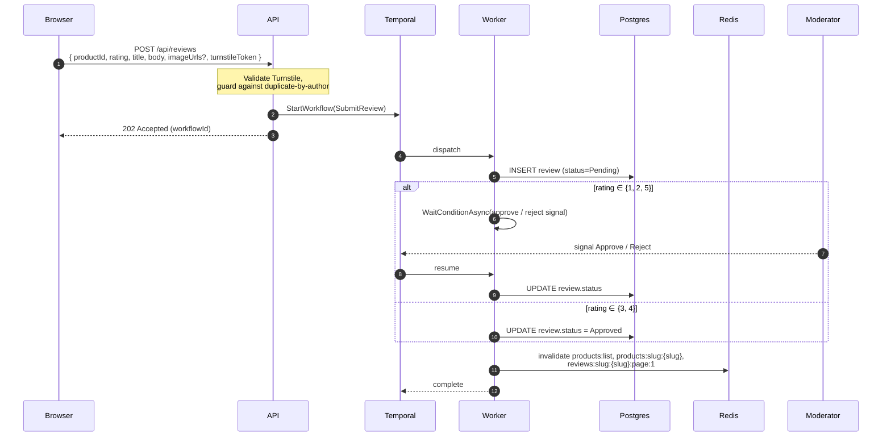

The workflow as a state machine:

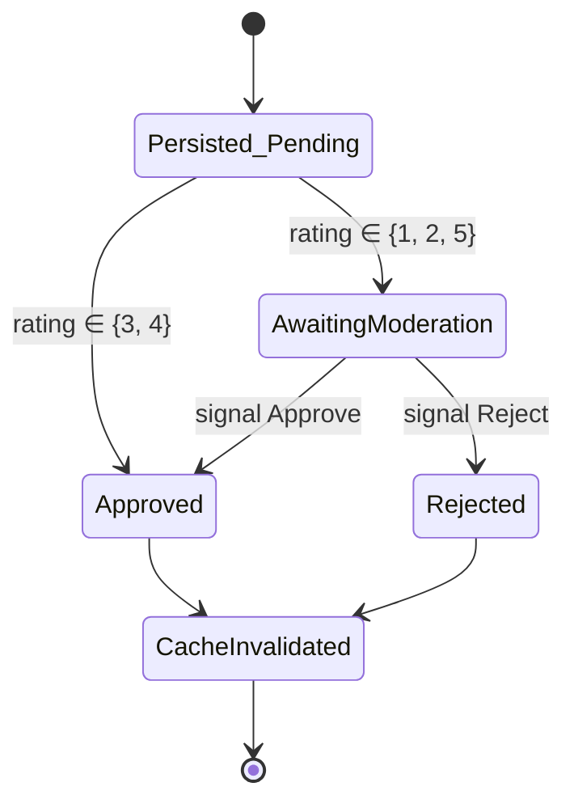

- **The row lands first, then waits.** Persisting Pending before the moderation wait means the moderator's tooling (Temporal UI today, an admin app later) can see what they're moderating without the workflow having to ship the payload. It also means the `(product, author, status != Deleted)` partial unique index is the real guard against duplicates — the API's pre-check is just a fast-path 409.
- **Why the API stays in the path.** Frontend talks to exactly one server. Temporal's gRPC frontend isn't authenticated for end users, and exposing it would let any client start any workflow. The API validates input, attaches the authenticated user, picks the workflow, and starts it.
- **Why Temporal and not a plain job queue.** The moderation branch is an arbitrary-length wait. Temporal's signal-and-resume model and durable timers give us the right primitives without rebuilding them in app code. Crashes between persist and cache-invalidate retry the *failed* activity, not the whole flow.
- **Why these rating buckets for moderation.** 1- and 2-star reviews are the most common targets of competitor abuse and venting; 5-star is where most fake or incentivised reviews land. 3 and 4 are the boring middle and rarely worth a moderator's time. Heuristics (account age, repeat-pattern detection) will replace or augment this later.
- **Cloudflare Turnstile.** The submit form gates on a Turnstile token, verified server-side by the API before the workflow starts. Stops scripted abuse at the cheapest point.

---

## 6. Editing your own review

A user edits their own review. Within an hour of creation it applies immediately; after that it goes through the same moderation gate as a fresh submission.

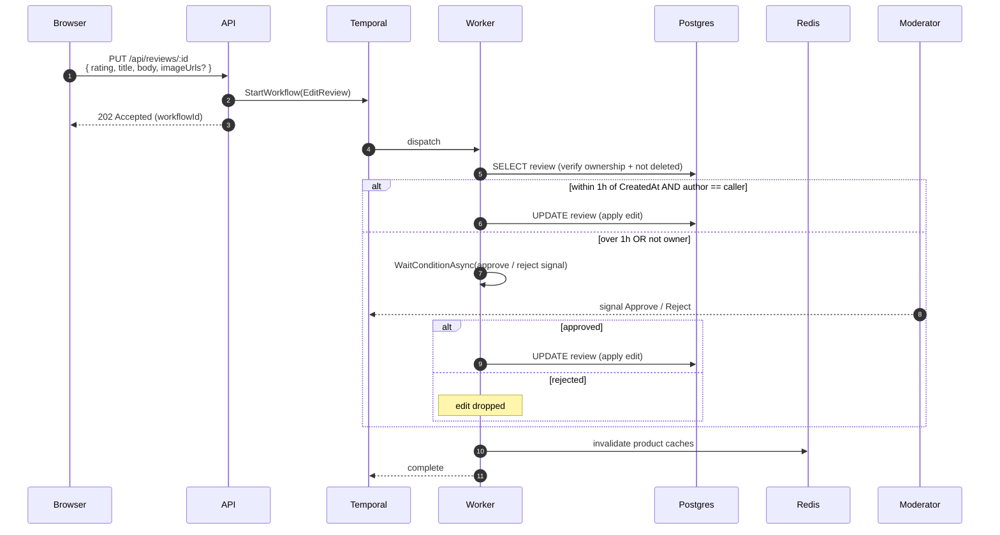

- **Ownership and freshness checked inside the workflow**, not just in the API. The activity reads the row again before applying — even if the `Authorize` lands minutes later, the check is against the row at apply-time, not the API request time.
- **One-hour cutoff is a starting heuristic.** It maps to the common "saw a typo, fixing it" pattern. Edits beyond the window are unusual and worth a moderator's attention.
- **Why a separate workflow from Submit.** Submit creates rows; Edit mutates existing ones with a different ownership story and different cache implications (a star-rating edit changes the product average; a body edit doesn't). Coupling them would tangle the state machines.

---

## 7. Deleting your own review

Same 1-hour policy as edit, soft-delete only. Deleted rows stay in the table (`status = Deleted`) so vote rows remain reconcilable and so moderators can see what was removed.

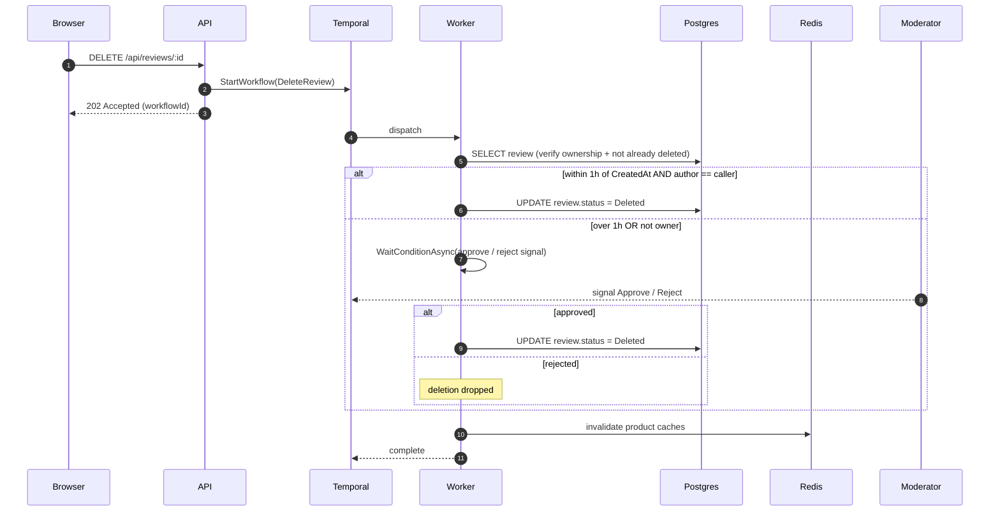

- **Soft delete only.** Vote rows reference the review by id; hard-deleting would either orphan them or require cascade cleanup that fights the "votes are durable evidence" property.
- **Listing endpoints filter `Status != Deleted`** so soft-deleted reviews disappear from the SPA but stay queryable for moderation tooling.

---

## 8. Voting on a review

A user upvotes or downvotes an Approved review. Every vote is its own row keyed on `(review_id, voter_id)` so we always know who voted what; the score on the review is a denormalised sum maintained off the vote rows.

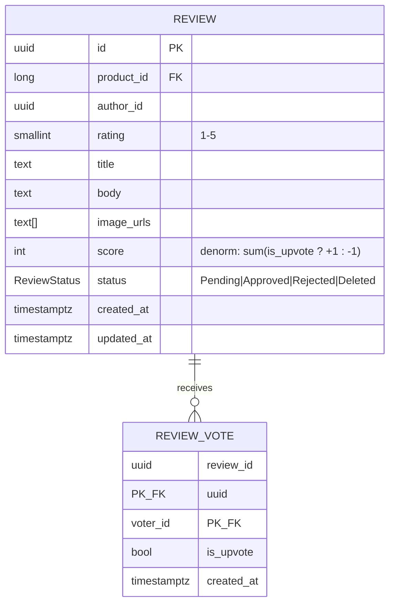

The composite primary key `(review_id, voter_id)` is what prevents double-voting and what makes flipping a vote a single UPSERT.

```mermaid
sequenceDiagram
    autonumber
    participant B as Browser
    participant A as API
    participant P as Postgres
    participant R as Redis

    alt cast or flip
        B->>A: POST /api/reviews/:id/vote<br/>{ isUpvote: true | false }
        A->>P: SELECT review where status = Approved
        A->>P: BEGIN TX
        A->>P: UPSERT review_vote (review_id, voter_id, is_upvote)
        A->>P: UPDATE review.score = (SELECT sum from votes)
        A->>P: COMMIT
        A->>R: invalidate product caches (with retry; best-effort)
        A-->>B: 200 OK<br/>{ score, myVote: true | false }
    else remove (click your active button)
        B->>A: DELETE /api/reviews/:id/vote
        A->>P: SELECT review where status = Approved
        A->>P: BEGIN TX
        A->>P: DELETE FROM review_vote WHERE (review_id, voter_id)
        A->>P: UPDATE review.score = (SELECT sum from votes)
        A->>P: COMMIT
        A->>R: invalidate product caches (with retry; best-effort)
        A-->>B: 200 OK<br/>{ score, myVote: null }
    end
```

- **Why synchronous, not Temporal.** Submit/edit/delete are durable workflows because they have moderation gates and multi-step coordination. A vote is a single transactional UPSERT plus a cache `DEL`; routing it through Temporal added end-to-end latency and coupled a UI-critical click path to workflow infra availability without buying anything in return. The denormalised score self-heals (next vote recomputes from rows), and cache invalidation has a 24h TTL backstop plus the next mutation re-DEL'ing the same keys, so a transient Redis failure is benign — `IReviewCacheInvalidator` retries a handful of times then logs and moves on.
- **Single endpoint with `isUpvote: bool`.** Flipping from up to down is one UPSERT, not delete-then-insert.
- **Removing your vote** — clicking the up/down button you've already cast issues `DELETE /api/reviews/:id/vote`, which drops the row, recomputes the score from the surviving rows, and returns `{ score, myVote: null }`. Idempotent: a delete with no prior vote is a no-op that still recomputes the score.
- **Why store every vote, not just aggregate counters.** We need to know *who* voted to enforce one-vote-per-user, to let users see and change their own vote, to detect abuse patterns (sockpuppet rings, vote brigades), and to recompute the score deterministically if the denormalised field ever drifts.
- **The denormalised score is a cache, not a source of truth.** The vote rows are. Every vote recomputes the score from `SUM(is_upvote ? +1 : -1)` over the current rows, so a missed UPDATE doesn't leave the system permanently inconsistent.
- **Vote permission gate.** Votes against a review whose `Status != Approved` return `404` — a stale client doesn't need to special-case the various non-approved states.
- **Response shape.** The handler returns `{ score, myVote }` (where `myVote` is `true`/`false` for cast/flip and `null` after removal) so the SPA patches the affected row in place and skips a follow-up `GET /reviews`.

---

## 9. Uploading review images

Reviews can carry up to 5 image URLs. The submit form uploads each image as a separate request, gets back a stable URL, and includes those URLs in the eventual review payload.

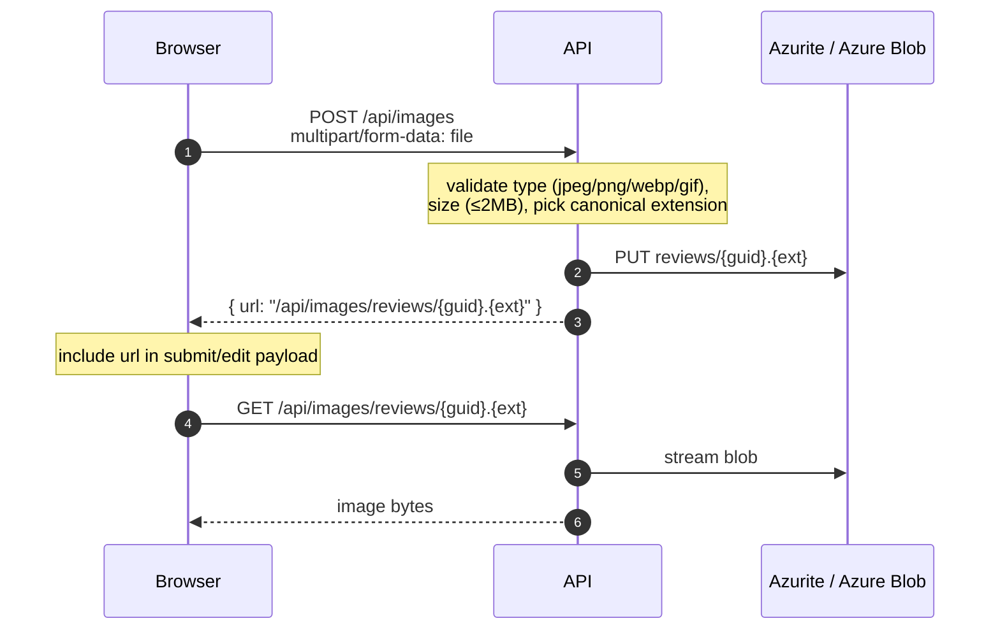

- **The browser-visible URL points back at the API**, not at Azurite or Azure Blob directly. This keeps URLs environment-agnostic — the same string works in dev (Azurite), in compose, and in production with real Azure Blob.
- **Validation lives in `ImagesController.Upload`.** Type is keyed off `Content-Type` (mapped through a switch to a canonical extension), size capped at 2 MB.
- **No moderation gate on uploads.** Image content moderation is a future feature — today the controller trusts the type/size check and the eventual review-level moderation catches abuse at submit time.
- **Roadmap.** Production should swap the read path to a CDN keyed on the same blob path (CloudFront / Cloudflare / Azure Front Door); the controller stays only as a fallback for private-asset egress.

---

## How moderators sign reviews today

There's no admin UI yet. Moderator approval happens by **opening the pending workflow in the Temporal UI** (<http://localhost:8233>) and sending a typed `Approve` or `Reject` signal. The workflow's `WaitConditionAsync` resumes from there — that's the whole moderation surface, deliberately kept thin so a real admin tool (or an MCP-backed agent) can replace it without changing the durable contract.
